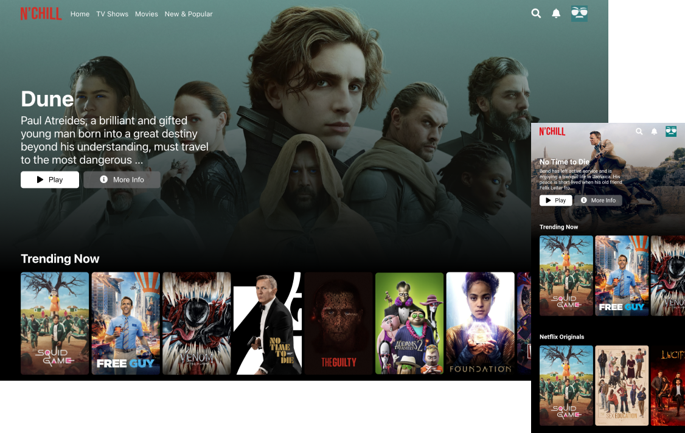

# Chill Clone (Netflix Clone)
##### *[Click Here](https://chillclone.kurtisgarcia.dev) for live site*
Although the user cannot actually watch any of the shows or movies, the purpose of this project is to allow users to browse different shows and movies based on what is currently trending, netflix originals, genres, etc. I tried to get as close to the Netflix UI as possible.

## Motivation
I wanted to build a project using the "The Movie DB" API and figured what better movie project than a netflix clone.

### Challenges and Solutions
A challenge that was difficult to overcome was getting the movie image in the hero section to change randomly every time the page is reloaded. I solved this issue by using "Math.floor(Math.random( ))" inside of the index of the results from the data that was fetched from the API. This allowed me to only get one random movie or show.I would like to refactor and do this more efficiently.

### Screenshots

### Features
- Users can browse different movies and shows based on what is currently trending, netflix originals, genres, etc.

- I plan to add feature for users to have the ability to add movies or shows to the "Save for later" page in adition to the ability to search for a specific movie.

**Technologies Used:**
- [React](https://reactjs.org/)
- [TheMovieDB API](https://www.themoviedb.org/documentation/api)
- [Axios](https://axios-http.com/docs/intro)

### API Reference
TheMovieDB API: https://www.themoviedb.org/documentation/api
